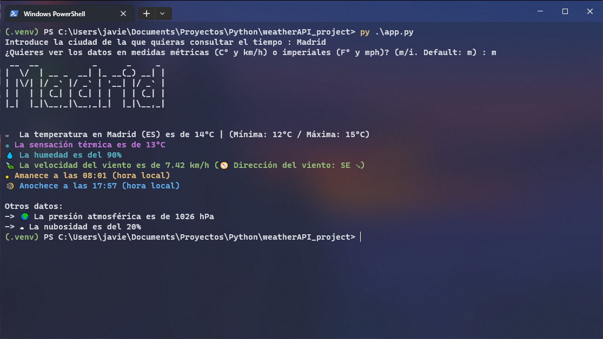

# Weather API Project

[](https://www.python.org/)

## Autor

* [Javier Picón](https://github.com/MCPikon)

## Vista previa



## Descripción

App del Tiempo creada con [Python](https://www.python.org/) (v3.11.5) que muestra los datos del tiempo de la ciudad que se le pase por consola. La app obtiene los datos de la API de [OpenWeatherMap](https://openweathermap.org/api)

## Instalación

Para poder ejecutar el proyecto en local hay que hacer lo siguiente:

1. Clona el repositorio:

```bash
git clone https://github.com/MCPikon/weatherAPI_project.git
```

> Antes de instalar nada, es necesario crear un archivo .env con la variable API_KEY con su respectivo token de la API OpenWeatherMap para que el programa funcione correctamente

2. Entra a la carpeta del proyecto e instala los módulos:

```bash
cd .\weatherAPI_project\
pip install -r requirements.txt
```

3. Arranca el proyecto:

```bash
python app.py
```

## Tecnologías

* Python 3.11.5
* _**Módulos:**_
  * certifi 2023.7.22
  * charset-normalizer 3.3.1
  * idna 3.4
  * pyfiglet 1.0.2
  * python-dotenv 1.0.0
  * requests 2.31.0
  * simple-chalk 0.1.0
  * urllib3 2.0.7

## Licencia

Este proyecto es de código abierto y está disponible bajo la [Licencia 2.0 de Apache](LICENSE).
